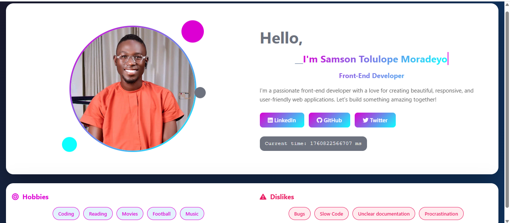

# Profile Card (HTML/CSS/Vanilla JS)

## Overview

A responsive, accessible **Portfolio Website** built with semantic HTML, CSS, and Vanilla JavaScript.  
It features multiple pages — **Profile**, **About**, and **Contact** — with smooth navigation, visual feedback, and form validation.  
Every page includes `data-testid` attributes for automated testing and accessibility labels for screen readers.

--

### The project includes:

- Navigation with active state highlighting  
- Hero section with a personal bio and background image  
- About section with areas of growth and learning  
- Contact form with validation and success toast  
- Fully responsive design from **mobile (360px)** to **large desktop (1440px+)**



---

## Features

**Semantic HTML5 structure** – uses `<header>`, `<section>`, `<main>`, `<nav>`, `<form>`, `<article>`, etc.  
**Accessibility-first** – includes `aria-label`, `alt`, and form accessibility attributes.  
**Responsive layout** – optimized for **Mobile → Desktop (360px – 1440px+)**.  
**Contact form validation** – with toast-style success message at bottom-right.  
**Multi-page navigation** – separate About and Contact pages.  
**Lightweight** – pure HTML, CSS, and Vanilla JS (no dependencies).  
**Testable** – all key elements include `data-testid` attributes.
  

---

## Folder Structure
project/
│
├── About/
│ ├── about.html # About page with personal bio
│ └── about.css # About page styling
│
├── Contact-Us/
│ ├── Contact.html # Contact page with form
│ ├── contact.css # Contact page styling
│ └── contact.js # Contact form validation and toast logic
│
├── image/
│ ├── Psalmotee.jpg # Profile image
│ └── Screenshot.png # Project preview screenshot
│
├── header.css # Global header and navigation styles
├── index.html # Homepage (Hero, Bio, and Sections)
├── styles.css # Global layout and responsive styles
├── script.js # Navigation toggle and shared JS
└── README.md # Documentation


---

## Getting Started

### Clone the repository
```bash
git clone https://github.com/your-username/profile-card.git
cd profile-card
```

### Run locally

Just open index.html in your browser — no build steps needed.

---

## Accessibility & Testing

Each page includes proper ARIA labels and data-testid attributes for automated testing and accessibility validation.

| Element | Data Test ID |
|----------|---------------|

### Profile Card
| Profile Card | `test-profile-card` |
| Name | `test-user-name` |
| Biography | `test-user-bio` |
| Current Time | `test-user-time` |
| Avatar | `test-user-avatar` |
| Social Links Container | `test-user-social-links` |
| LinkedIn | `test-user-social-linkedin` |
| GitHub | `test-user-social-github` |
| Twitter | `test-user-social-twitter` |
| Hobbies | `test-user-hobbies` |
| Dislikes | `test-user-dislikes` |

### Contant Us
|Full name — `test-contact-name` |
|Email — `test-contact-email` |
|Subject — `test-contact-subject` |
|Message — `test-contact-message` |
|Submit button — `test-contact-submit` |
|Error messages — `test-contact-error-<field> (e.g., ` ||`test-contact-error-email)` |
|Success message (after valid submission) — `test-contact-success` |

### About Me
|Bio — `test-about-bio` |
|Goals in this program — `test-about-goals` |
|Areas of low confidence — `test-about-confidence` |
|Note to future self — `test-about-future-note` |
|Extra thoughts — `test-about-extra` |


---

## Responsiveness

The layout adapts fluidly:
360–480px: Stacked mobile layout
768px: Two-column structure
1024px: Balanced desktop layout
1440px+: Expanded spacing and typography

### Notes

For automated tests, Date.now() is updated every second for accuracy.

Fully keyboard-accessible: links and sections are navigable with Tab.

## Author

Moradeyo Samson Tolulope (Psalmotee)
Frontend Developer passionate about elegant, accessible, and performant user interfaces.

📧 Email: [samsonmoradeyo@gmail.com]
🌐 Portfolio: [https://portfolio-psalmotee.netlify.app]
🐙 GitHub: [https://github.com/psalmotee]

Built with Love by Psalmotee Tech
